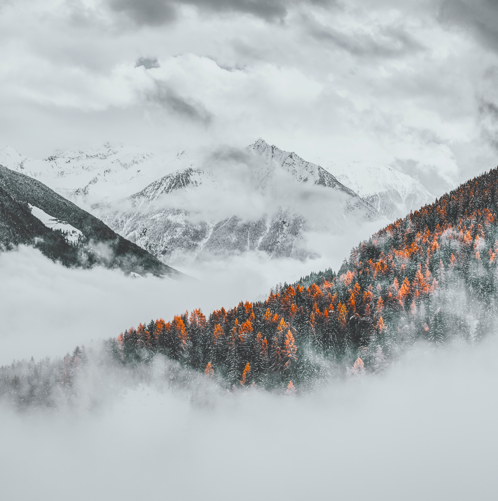
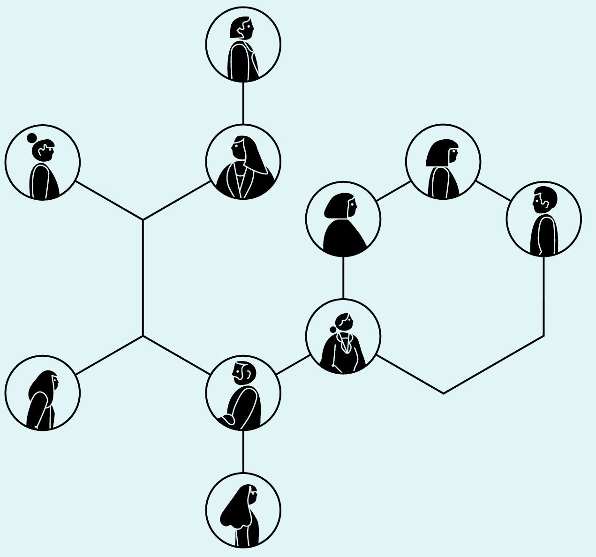
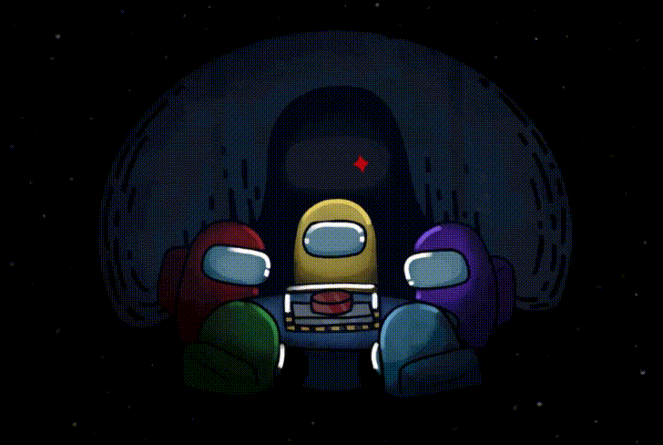
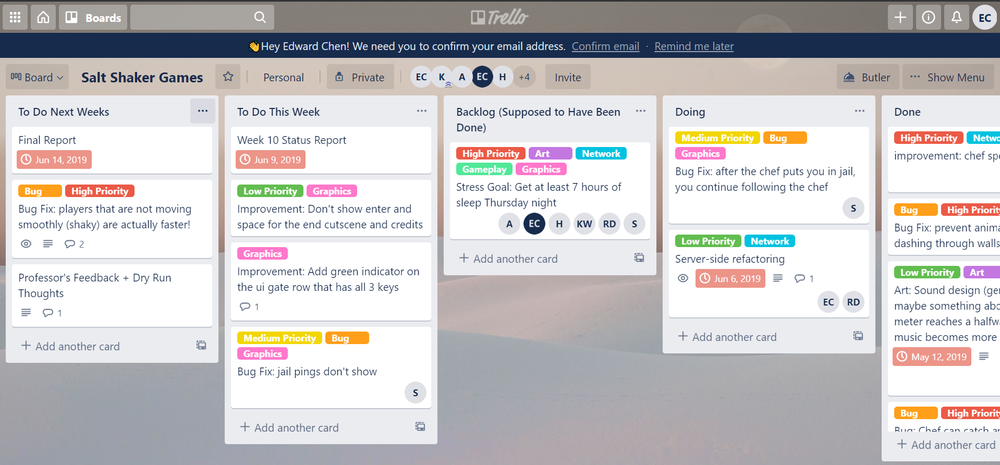
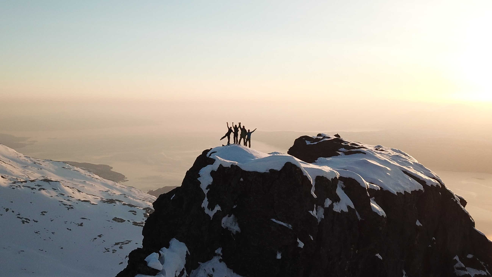

### Helpful tips and takeaways from a former student and TA. 

> The goal of CSE 125 is to experience the design and implementation of a large, complex software system in large groups. . . To make the class exciting as well as challenging, the project is a distributed, real-time, 3D, multiplayer game of each group's design."
> 
—<a href="https://cse125.ucsd.edu/" target="_blank"> cse125.ucsd.edu</a> 

 

# Introduction

Reflecting on CSE 125, both as a student and as a TA, I have to admit that this has
been by far my favorite course I have taken at UCSD. I enjoyed all of it: from blue
skying new game designs and features with my fellow teammates to staying up late in
the labs ordering McDonald's food delivery to remotely testing out games on the demo
machines this past Spring.

    

        

            I felt like CSE 125 is a lot like climbing a mountain. The road might be tough. The
            summit might be misty. And you might stumble. But with incremental steps and a
            supportive team, you will slowly reach the top. And don't worry, there are also
            plenty of teams who have summited their own mountains! Before starting your own
            trek, I would highly recommend taking some time to learn about their journeys and
            how they navigated their mountains.
        

        <ul>
            <li><a href="https://cse125.ucsd.edu/2020/groups.html" target="_blank">2020 Traveler's Log</a></li>
            <li><a href="https://cse125.ucsd.edu/2019/groups.html" target="_blank">2019 Traveler's Log</a></li>
        </ul>
    

    

        <a href="https://www.pexels.com/photo/photo-of-trees-across-mountains-under-cloudy-sky-3389536/"
            target="_blank">
            
            
        </a>
    

With the onset of the COVID-19 pandemic, I found that many of my normal day
activities were taken for granted. From waving hi to my friends in the CSE dungeons
to setting up in-person team meetings by the benches in front of Burger King-- much
of our face-to-face interactions have been replaced with Zoom meetings with our
webcams off.

As a past student and TA for the course during the start of the pandemic, I've laid
out 4 helpful takeaways and tips that I believe will help teams climb the CSE 125
mountain, Mt. CSE 125, especially in a remote environment.

# 1. Get to Know Your Team

    

        This might seem like an absolute no-brainer, but it is a simple starting step that
        can get lost in a remote setting. According to a <a href="https://rework.withgoogle.com/print/guides/5721312655835136/" target="_blank">Google research study</a> conducted on
        +180 active teams, the top 2 factors that contribute to a team's success
        are psychological safety & dependability. This means each member on the team should
        feel comfortable sharing new ideas to the team and asking each other for help. Team
        members should also be able to trust in each other to complete their deliverables. 
        If you're curious about other factors that make teams successful, be sure to check
        out the study!
    

    <a href="https://static01.nyt.com/images/2016/02/28/magazine/28mag-teams2/28mag-teams2-superJumbo.jpg?quality=90&auto=webp"
        target="_blank">
        
        
    </a>

From my experiences, I found that meeting up with my team, especially outside of
course/development hours, helped bring everyone on the team closer together.
Often times, my team would get lunch in Price Center, study in the CSE dungeons,
play online games, and attend school events together. We had even planned a group
DMV trip to register for our Real IDs; a trip that unfortunately ended up taking
over 6 hours because I managed to lock myself out of my own car (and according to my
team, I'll never live this down). Our team had a lot of face-to-face interactions
that bonded each of the team members closer together.

Since I was able to get to closer to my team, bouncing new ideas, proposing last
minute changes, and even simply asking for help was easy to do. Everyone on the
team felt connected with one another and on the same page.

## Meet regularly

In a remote setting, it might be a bit more difficult to get this same level of
cohesion within the team. I would recommend setting up a reoccurring team lunch
just to hang out and chitchat, play some online games together, and consider
even setting up a [Discord](https://discord.com/) server for the team. These events and
meet-ups will serve as a great introduction to see what types of games your
teammates would like to build, find our their favorite quarantine activities, and
get to know each other better.

    

        <a href="https://imgur.com/gallery/JPwXKHW" target="_blank">
            
            
        </a>
    

    

        

            Here's also a list of popular online games to try out to start the team bonding!
        

        <ul>
            <li><a href="https://store.steampowered.com/app/945360/Among_Us/" target="_blank">
                    Among Us</a></li>
            <li><a href="https://skribbl.io/" target="_blank">
                    Skribbl.io</a></li>
            <li><a href="https://really.boring.website/" target="_blank">
                    Scattergories</a></li>
            <li><a href="https://codenames.game/" target="_blank">
                    CodeNames</a></li>
            <li><a href="https://drawbattle.io/" target="_blank">
                    draw battle!</a></li>
        </ul>
    

# 2. Project Management
One unique aspect of CSE 125 compared to other CSE courses is that the class structure is dependent on the team. There aren't any lectures that you need to attend --with the caveat of some amazing guest lectures-- or bi-weekly homework that you need to submit. Therefore all of the team's deadlines, design decisions, and productivity hours are established solely by the team. To ensure your team understands what needs to be done each week, I recommend that your team invests in a project management tool and have a regular project planning session.

For each project planning session, there are 3 main questions that need to be answered.

1. What have you done this week?
2. What are you planning on accomplishing by next week?
3. Are there any blockers?

## Focus on working code
Given the time constraint of 10 weeks to build a fully functioning 3D multiplayer video game, it is important to focus on rolling out a ***working product*** than having the cleanest system design. Having productive project planning sessions will help keep the team's focus on the end goal while simultaneously ensuring there isn't redundant work being completed by separate people. Planning out your current and future tasks is just as important as navigating which mountain trails to climb.

    

        

            Here are a few Kanban boards to help you get started!
        

        <ul>
            <li><a href="https://docs.github.com/en/free-pro-team@latest/github/managing-your-work-on-github/about-project-boards"
                    target="_blank">
                    Github Project Boards</a></li>
            <li><a href="https://trello.com/" target="_blank">
                    Trello</a></li>
            <li><a href="https://asana.com/" target="_blank">
                    Asana</a></li>
            <li><a href="https://www.notion.so/" target="_blank">
                    Notion</a></li>
        </ul>
    

    

        <a href="https://www.pexels.com/photo/schedule-planning-startup-launching-7376/"
            target="_blank">
            
            
        </a>
    

## Personal experiences 
When I took CSE 125 back in 2019, my team agreed upon using a Trello board. The board was structured with a list of future todos **(To Do Next Weeks)**, current list of open tasks to complete by this week **(To Do This Week)**, a list of backlog tasks to come to if members of the team had extra time **(Backlog)**, the set of tasks teammates were currently working on **(Doing)**, and finally a list of completed items **(Done)**.

At the beginning of the quarter, my team and I had a brainstorming session to think of all the possible tasks that need to be completed for this project. Each of the tasks we came up with were added as a new card into the **To Do Next Weeks** section. These tasks included high level features such as having a working server and client, creating a character model in Maya, loading a model into a world, and incorporating player collisions. At the end of our brainstorm session, we sorted each task by priority and assigned the highest priority tasks to be completed first. Although this won't be a complete list, this list will help guide the team for future time priority adjustments and task assignments

Each week, our team would have a project planning session to understand which tasks have been completed and which tasks have not. Tasks that have been completed will be moved into the **Done** list while those that have not will be moved into the **Backlog** list. Newly assigned tasks will be moved from the **To Do Next Weeks** list to the **To Do This Week** list, and as teammates start their tasks, they will move the task from **To Do This Week to Doing**.

# 3. Group Coding

Yes, I am talking about pair programming... but not exactly in the same sense as the traditional definition. With the lack of face-to-face interactions, it is often times hard to discuss game ideas and let the creativity flow between team members. It is also hard to get help and resolve blockers when there's a waiting time involved. In 2020, many of the teams would typically hop on a Zoom or Discord call and code together. They may not be exactly working on the same piece of code, but it is always nice to work in a more lively environment and have some friends to bounce ideas off of.

    

        

            One super helpful tool to use is <a
                href="https://code.visualstudio.com/blogs/2017/11/15/live-share"
                target="_blank"> Visual Studio Code Live Share</a>,
            which basically changes the VSCode editor into a Google doc. One user can open
            up a VSCode Live Share session and share their session link with their
            teammates. After joining, each member can work within the <i>same</i> code
            editor at the same time. I found this feature to be very useful for remote
            development and debugging sessions.
        

    

    

        <a href="https://code.visualstudio.com/blogs/2017/11/15/live-share" target="_blank">
            
            
        </a>
    

# 4. Game Design

One of my favorite aspects of CSE 125 is that each team has the freedom to climb any mountain they want. In other words, teams can design any game they would like - under the constraints that they are able to build the game within 10 weeks. In the past years, teams have built their own versions of first person shooters, tower defense games, battle arena games, boss battle games, games with imbalanced teams, games with a building stage and then a fighting stage… the list goes on and on. ***There are a few running motifs that appear when designing games.***

## Reference existing games
Many teams like to reference mechanics from existing games as starting point for designing their own games. Looking at the games from 2020, [Cyber City](https://cse125.ucsd.edu/2020/cse125g3/) was a cyberpunk, tower defense, battle arena game that had a similar minion and turret system based off of League of Legends. [Grow Away](https://cse125.ucsd.edu/2020/cse125g5/wordpress/), a plant-based, tower defense game, took concepts from Plants vs. Zombies, OverCooked, and Bloons Tower Defense.

## Focus on a mechanic
Another popular path is to come up with a new or existing mechanic and use this mechanic as a focal point for the game. [Gaia](https://cse125.ucsd.edu/2020/cse125g1/blog/) was a game that had a fairly simple graphics but a unique terrain manipulation feature. Each team consisted of 2 players, one player controlling a sphere that can roll around and collect coins, and another player that could raise and lower mountains to help their sphere traverse the terrain easier or block the other team's sphere.

Another example is [Stikbold!](https://www.youtube.com/watch?v=9uMG5lFRf5Y), a groovy 70s-themed fantasy dodge-ball game. This game elevates this simple well-known game by adding new interactive elements into the surrounding environment and inducing random chaotic events.

## Create something new
 

    

        

            There are as many mountains that have yet to be explored as there are different,
            wonky games that have yet to be built. Here are two examples of games
            that have amazed me with their simple controls but extensive game features. <a
                href="https://www.youtube.com/watch?v=kqZgVWbw_aE" target="_blank"> 
                Push Me Pull You</a>, an award-winning local multiplayer
            game about friendship and wrestling. Players are joined at the waist and share a
            long, wriggling body. The overall win condition of the game is very simple, whoever
            controls the ball the longest wins!
        

        

            Another game with players with a conjoined body
            is <a href="https://www.youtube.com/watch?v=8s26rpR3nWg" target="_blank"> 
            PHOGS!</a>, except this game is all about solving
            puzzles and strategical thinking.
        

    

    

        <a href="https://www.youtube.com/watch?v=kqZgVWbw_aE" target="_blank">
            
            
        </a>
        <a href="https://www.youtube.com/watch?v=8s26rpR3nWg" target="_blank">
            
        </a>
    

## Design questions
- What style game would you like to build? (Strategy, Survival, Battle Royale, Exploration, a mix?)
- What perspective do you imagine your game to be in? (1st-person, 3rd-person...)
- How do you imagine the game's win condition to be? (times, points, lives...)
- How do you imagine the game to look? How will it be played?

## Keep it simple
Although there are very little restrictions on what type of game your team can build, there always seems to exist some unforeseen force that tries to mess things up. Some unknown bug in the animation code. Some deadlock in server causing the game to crash. Overestimating the time it takes to finish a task. For this course, I would recommend striving for having a ***simple working product*** first and leaving open ends to incorporate additional game features!

# Conclusion
If you've made it this far, I hope you found these takeaways insightful!
Looking back, CSE 125 seemed like a monumental mountain to climb, but each step
along the way was very rewarding. The journey will be well worth the effort. And
with that...

#### I'm excited to see which mountains you will decide to climb :) ###

##### Acknowledgements
Special thanks to Kate, Leon, Sterling, and Charles for their productive feedback and revisions.
